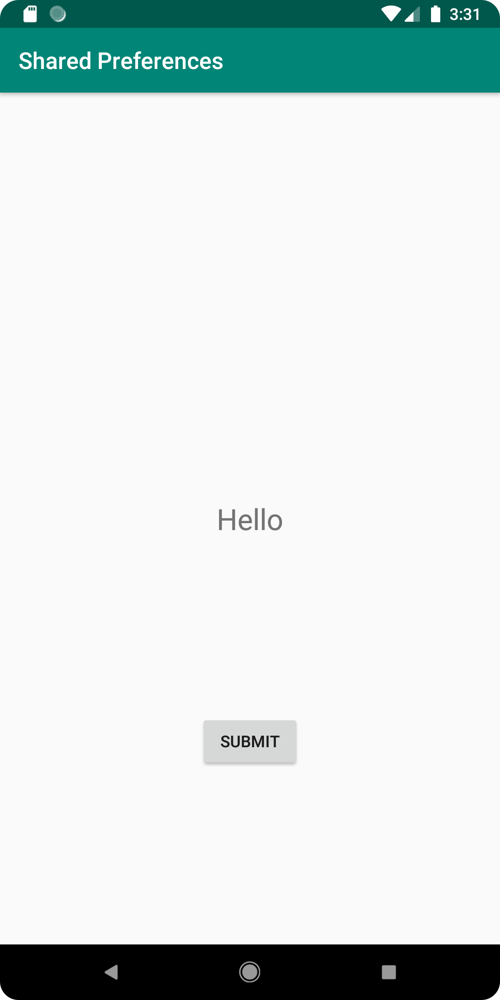
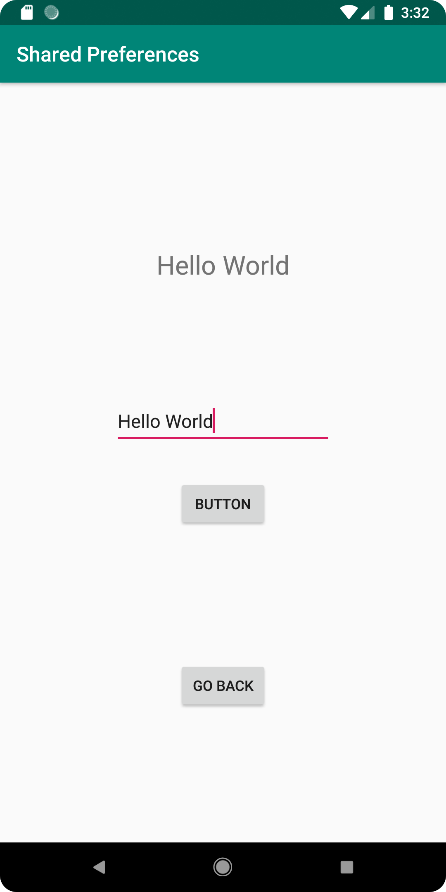
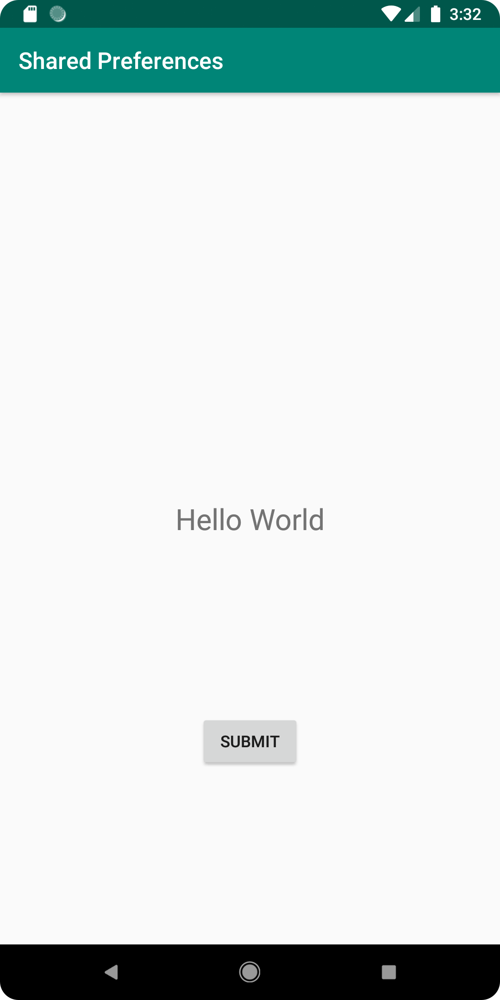

# Rapport
I uppgiften ska innehåll som skrivs på en sida visas på en annan. För att kunna visa innehållet används
en TextView element och för att kunna navigera till andra sidan används ett Button element (se figur 1).
En till activity skapas som får namnet SecondActivity och Button elementet kodas med en intent (se figur 2).
I xml filen activity_second läggs ett EditText element så användaren kan skriva in text, 
ett TextView element som visar vad om senast skrevs in och två button element där ett av dem används för att  
spara innehållet från EditText elementet och andra för att kunna naviera tillbaks till MainActivity (se figur 3).
I MainActivity och SecondActivity skapas två variabler, en för SharedPreferences och en för SharedPreferences.Editor (se figur 4).
SharedPreferences initieras i onCreate i båda acitivities (se figur 5).
För att spara skapas en void funktion som får nanmnet savePref vilket intitieras av button element @button2,
samma kod som initerar SharedPreferences körs också i funktionen samt kod som får texten i EditText elementet att 
försvinna när när funktionen körs (se figur 6).
För att se till så TextView elementet i MainActivity sparar värdet från TextEdit elementet när appen stängs ner
används en funktion där onResume körs (se figur 7). 


Figur 1
```
<TextView
        android:id="@+id/prefText"
        android:layout_width="wrap_content"
        android:layout_height="wrap_content"
        android:text="@string/app_name"
        android:textSize="25sp"
        app:layout_constraintBottom_toBottomOf="parent"
        app:layout_constraintEnd_toEndOf="parent"
        app:layout_constraintStart_toStartOf="parent"
        app:layout_constraintTop_toBottomOf="@+id/appBarLayout" />

    <Button
        android:id="@+id/button"
        android:layout_width="wrap_content"
        android:layout_height="wrap_content"
        android:text="Submit"
        app:layout_constraintBottom_toBottomOf="parent"
        app:layout_constraintEnd_toEndOf="parent"
        app:layout_constraintStart_toStartOf="parent"
        app:layout_constraintTop_toBottomOf="@+id/prefText" />
```
Figur 2
````
Button button = findViewById(R.id.button);
        final Intent intent = new Intent(MainActivity.this, SecondActivity.class);

        button.setOnClickListener(new View.OnClickListener(){
            @Override
            public void onClick(View view) {
                startActivity(intent);
            }
        });
````   
Figur 3
````
<EditText
        android:id="@+id/WriteForPref"
        android:layout_width="wrap_content"
        android:layout_height="48dp"
        android:layout_marginBottom="32dp"
        android:ems="10"
        android:text="@string/save"
        app:layout_constraintBottom_toTopOf="@id/button2"
        app:layout_constraintEnd_toEndOf="parent"
        app:layout_constraintStart_toStartOf="parent"
        app:layout_constraintTop_toTopOf="parent"
        app:layout_constraintVertical_chainStyle="packed" />

    <Button
        android:id="@+id/button2"
        android:layout_width="wrap_content"
        android:layout_height="wrap_content"
        android:onClick="savePref"
        android:text="Button"
        app:layout_constraintBottom_toBottomOf="parent"
        app:layout_constraintEnd_toEndOf="parent"
        app:layout_constraintStart_toStartOf="parent"
        app:layout_constraintTop_toBottomOf="@+id/WriteForPref" />

    <TextView
        android:id="@+id/prefText"
        android:layout_width="wrap_content"
        android:layout_height="wrap_content"
        android:text="TextView"
        android:textSize="25sp"
        app:layout_constraintBottom_toTopOf="parent"
        app:layout_constraintEnd_toEndOf="parent"
        app:layout_constraintStart_toStartOf="parent"
        app:layout_constraintTop_toBottomOf="@+id/WriteForPref" />

    <Button
        android:id="@+id/backButton"
        android:layout_width="wrap_content"
        android:layout_height="wrap_content"
        android:text="Go Back"
        app:layout_constraintBottom_toBottomOf="parent"
        app:layout_constraintEnd_toEndOf="parent"
        app:layout_constraintStart_toStartOf="parent"
        app:layout_constraintTop_toBottomOf="@+id/button2" />
````
Figur 4
````
 private SharedPreferences myPreferenceRef;
 private SharedPreferences.Editor myPreferenceEditor;
````
Figur 5
````
myPreferenceRef = getSharedPreferences("MyPreferenceName", MODE_PRIVATE);
myPreferenceEditor = myPreferenceRef.edit();
````
Figur 6
````
public void savePref(View v){
        // Get the text
        EditText newPrefText=new EditText(this);
        newPrefText=(EditText)findViewById(R.id.WriteForPref);

        myPreferenceEditor.putString("MyAppPreferenceString", newPrefText.getText().toString());
        myPreferenceEditor.apply();

        TextView prefTextRef=new TextView(this);
        prefTextRef=(TextView)findViewById(R.id.prefText);
        prefTextRef.setText(myPreferenceRef.getString("MyAppPreferenceString", "No preference found."));

        newPrefText.setText("");
    }
````
Figur 7
````
protected void onResume() {
        super.onResume();

        myPreferenceRef = getSharedPreferences("MyPreferenceName", MODE_PRIVATE);
        myPreferenceEditor = myPreferenceRef.edit();

        TextView prefTextRef=new TextView(this);
        prefTextRef=(TextView)findViewById(R.id.prefText);
        prefTextRef.setText(myPreferenceRef.getString("MyAppPreferenceString", "No preference found."));
    }
````




